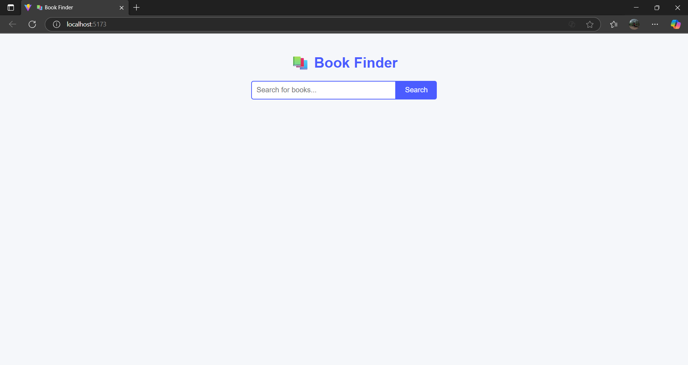
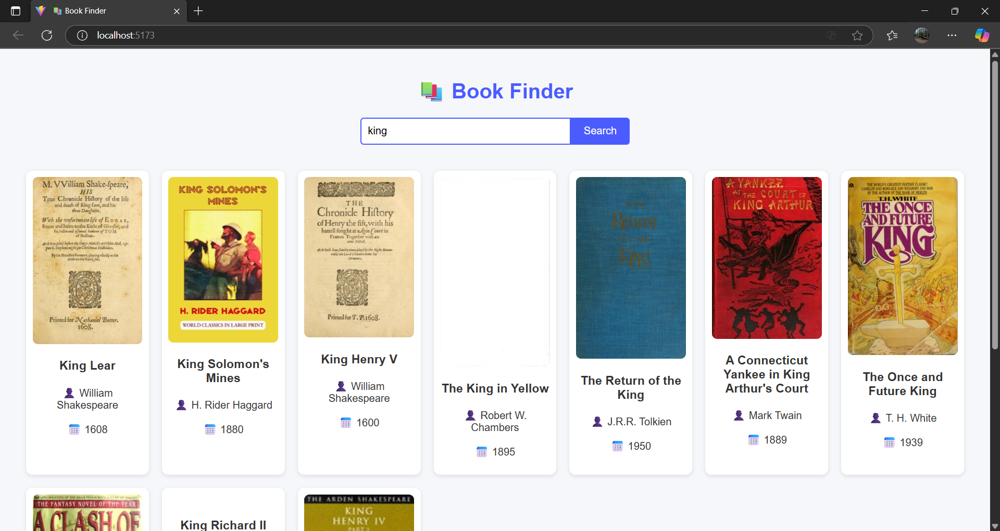
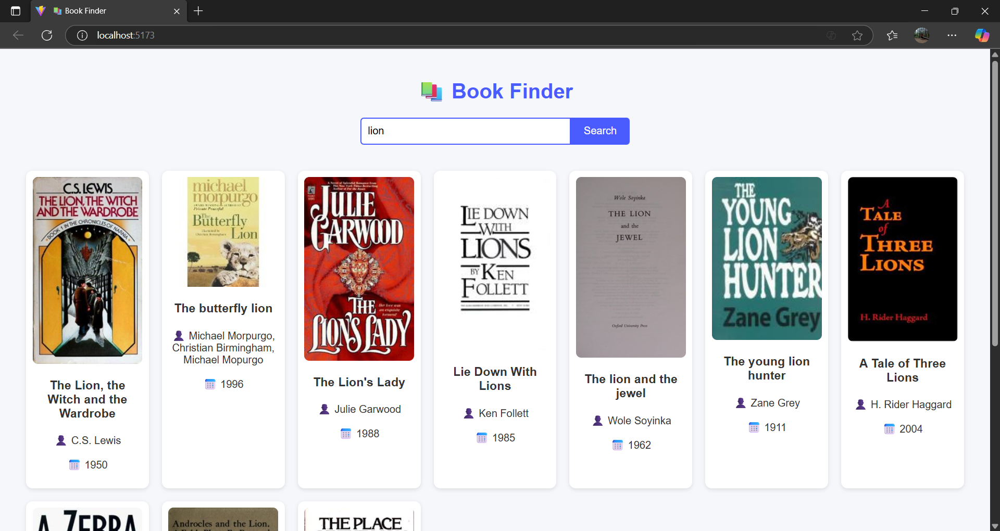

# 📘 Book Finder

A simple **Full Stack Book Finder App** built with **React (Vite)** and **Express.js**, powered by the **Open Library API**.

This project was created as part of the **Aganitha Full Stack Developer Take-Home Exercise (2024-25)**.  
The app helps users search for books by title and view details such as author, publish year, and cover images.

---

## 🚀 Features
- 🔍 Search books by title  
- 📚 View author, publication year, and cover  
- ⚡ Fast and responsive interface  
- 🧠 Backend proxy using Node.js + Express  
- 🌐 Uses the Open Library API (`https://openlibrary.org/search.json?title=`)

---

## 🧠 Tech Stack
| Layer | Technology |
|-------|-------------|
| Frontend | React (Vite), Axios |
| Backend | Node.js, Express |
| API | Open Library API |
| Hosting | (CodeSandbox / StackBlitz / Localhost) |

---

## Screenshot




## ⚙️ How to Run Locally

### 1️⃣ Clone the repository
```bash
git clone https://github.com/AnupriyaCH/book-finder.git
cd book-finder
